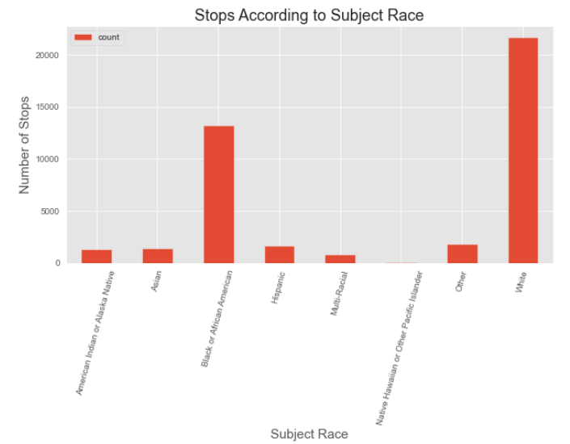
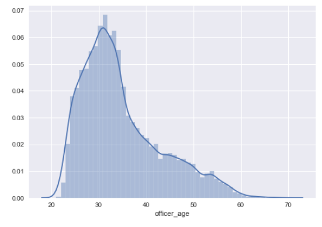

# Analysis of Terry Stops in Seattle, Washington, USA
***

 

## Terry Traffic Stops
***

In Terry v. Ohio,  a landmark Supreme Court case in 1967-8, the court found that a police officer was not in violation of the "unreasonable search and seizure" clause of the Fourth Amendment, even though he stopped and frisked a couple of suspects only because their behavior was suspicious. Thus was born the notion of "reasonable suspicion", according to which an agent of the police may e.g. temporarily detain a person, even in the absence of clearer evidence that would be required for full-blown arrests etc. **Terry Stops are stops made of suspicious drivers.**

We are looking to predict whether an arrest was made after a Terry Stop, given information about the presence of weapons, the time of day of the call, etc.

## Objectives
***
The objectives of this data analysis was to gain presepctive and understanding of the Terry Stops data. Using this data, I was able to predict arrests made after Terry Stops using Binary Classification. This analysis can give the Seattle Police Department and local Seattle government better insight into the demographics of these Terry Stops so that they can better their interactions with citizens of Seattle.

## Data Understanding
***
#### Data column names and descriptions
* Subject Age Group: 10 year increments as reported by the officer
* Subject ID: Key, generated daily, identifying unique subjects
* GO / SC Num: "General Offense" or Street Check Number, relating the Terry Stop to the Parent Report
* Terry Stop ID: Key Identifying Terry Stop Reports Stop Resolution: Resolution of the Stop as reported by the officer
* Stop Resolution: Resolution of the stop as reported by the officer
* Weapon Type: Type of weapon, if any, identified during a search or frisk of the subject. Indicates "None" if no weapons was found.
* Officer ID: Unique key identifying officers in the dataset
* Officer YOB: Year of brith as reported by the officer
* Officer Gender: Gender of the Officer
* Officer Race: Race of the Officer
* Subject Percieved Race: Race of the subject as reported officer
* Subject Percieved Gender: Percieved gender as reported by the officer
* Reported Date: Date the Report was filed
* Reported Time: Time the stop was reported
* Initial Call Type: Initial classicifaction of the call as assigned by 911
* Final Call Type: Final classicifaction of the call as assigned by 911
* Call Type: How the call was recieved by the communication center
* Officer Squad: Functional sqaud assignment (not budget) of the officer as reported by the Data Analytics Platform (DAP)
* Arrest Flag: Indicator of whether or not a physical arrest was Made, of the subject, during the Terry Stop. Does not necessarily relfect a report of an arrest in Records Management System (RMS)
* Frisk Flag: Indicator of whether a frisk was conducted
* Sector: Sector of the address associated with the Computer Aided Dispatch (CAD) event. Not necessarily where the Terry Stop occurred
* Precinct: Precinct of the address assictaed with the CAD event. Not necessarily where the Terry Stop occurred
* Beat: Beat of the address associated with the underlying CAD event. Not nen=cessarily where the Terry Stop occurred*

This data was obtained from www.data.gov City of Seattle website. The data contains information recaring
This data represents records of police reported stops under Terry v. Ohio, 392 U.S. 1 (1968). Each row represents a unique stop.Each record contains perceived demographics of the subject, as reported by the officer making the stop and officer demographics as reported to the Seattle Police Department, for employment purposes. Where available, data elements from the associated Computer Aided Dispatch (CAD) event (e.g. Call Type, Initial Call Type, Final Call Type) are included. For this dataset, I am looking to predict arrests using features in the dataset.

## Exploratory Data Analysis
***

### Which Race is Stopped the Most?
 

#### Graphic Description
The graph above displays Terry Stops according to the subjects' race. The graph shows that White subjects are stopped the most, followed by black/African-American subjects. However, some subject demographics were missing from the data, so further data collection would be necessary.

***
### What demographic of officers perform the most stops?
 

#### Graphic Description
The first graphic above displays the Terry Stops officer race demographic. The officers who performed the most stops were white. However, some officer demographics were missing from the data, so further data collection would be necessary. The second graphic shows the genders of the officers who performed the Terry Stops.

***
### Is there a Difference in Subject Ages across their Races?
 

#### Graphic Description
The graph above shows the Terry Stops subjects' age-group, according to race. Across all races, the majority of subjects that were stops were within the 26-35 age group.

***
### What is the Distribution of Officer Ages?
 
 

#### Graphic Description
The graph above displays the Terry Stops officer ages.

***
### What Subject Age Groups are Most Stopped and are they Carry Weapons?

#### Graphic Description
The graph above displays the Terry Stops subjects' age groups and whether or not the subjects were carrying weapons.

***
### What Subject Races are Most Stopped and are they Carry Weapons?

#### Graphic Description
The graph above displays the Terry Stops subjects' races and whether or not the subjects were carrying weapons.

## Model and Model Performance
***

#### Model
 
#### Model Confusion Matrix
 
#### Model Description

After cleaning the provided Terry Stops dataset, the data was split 75/25 using the sklearn.model_selection train_test_split package. The data containing continuous values has been normalized using sklearn.preprocessing StandardScaler() package. The data containing categorical values was one hot encoded. Using imblearn.over_sampling SMOTE() function, the imbalanced data was balanced by increasing the minority class. A custom classifier was created with sklearn's BaseEstimator with ClfSwitcher to pass any classifier and parameters for each classifer. This custom classifier was used along with a Pipeline and GridSearchCV. The classifiers used included: KNeighborsClassifier(), RandomForestClassifier(), AdaBoostClassifier(), and GradientBoostingClassifier().

GradientBoostingClassifier() had the best model performance. This classifier showed to have a training accuracy score of 0.945 and a testing accuracy score of 0.820. I found the most imoportant features to be 'frisk', 'officer_yob', 'stop_resolution_Arrest'.

## Conclusions
A majority of Terry Stop subjects were White, immediately followed by Black/African-Americans. According to [Seattle's government website](https://www.seattle.gov/opcd/population-and-demographics/about-seattle#raceethnicity), Seattle's African-American population is 6.8% of the whole population compare to Seattle's White population that make up 68% of the whole. However, African-Americans make about 1/3 of Terry Stops. Across all races, the subject that were most stopped were those belonging to the age group 26-35. This age group made up a third of the dataset and also more likely to carry weapons on their person. As for officer demographics, a majority of officers were white men. 

## Recommendations
For the government of Seattle and the Seattle Police Department to better serve their citizens, I would recommend the following. First Seattle Police department should be hiring more officers belonging to minority communities and women as well. A majority of the Seattle PD are white men, which could cause problems when they are policing minority communities. Women officers can bring a new perspective to the police force which would be a good change. I would recommend Seattle PD to reallocate their weapons budjet to advancing health care plans to include mental health services like therapy so that officers can better understand themselves and any biases they may have towards certain communities. A majority of Terry Stop subjects do not have weapons, so their is really no need for officers to have so much military aid.  With more focus on the betterment of police practices and the police themselves, there will less lawsuits against police for abuse of power and that saves Seattle a lot of money.

## Future Work
This dataset contained a lot of NaN or incomplete information, so more data collection should be made before this analysis can be 100% approved. There were a lot of data columns that had a majority of the data missing so I did not use them in my analysis even though they could hav eprovided some interesting insights. I would want more data collection to occur in minority communitites, because I am sure the Terry Stop data in those communities would be a lot different than this dataset.
